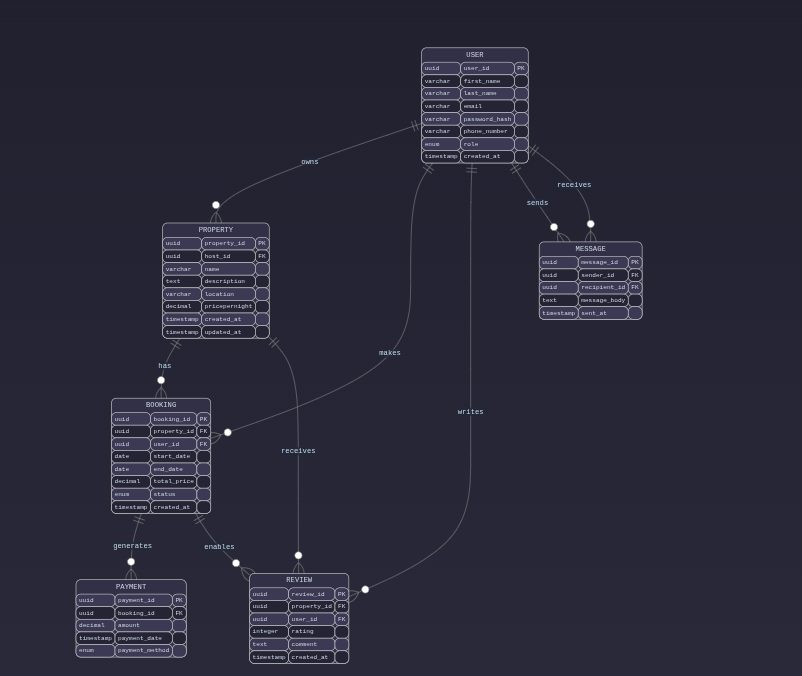
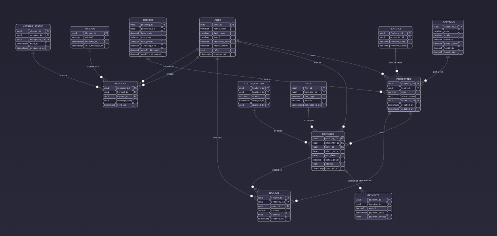

# 📦 Alx-Airbnb-Database Normalization

## 🎯 Objective

To apply normalization principles to ensure the database is in the **third normal form (3NF)**.

---

## 📊 ER Diagrams Overview

### Before Normalisation



---

### ✅ Normalised Schema (3NF)



---

## 🔍 Review

Reviewing the current schema reveals several potential normalization issues.

### 🏠 Entity Redundancy
- `description` contains unstructured data.
- `price` calculations might become outdated.

### 📅 Booking Dependencies
- `status` transitions (pending → confirmed → cancelled) aren't clearly defined.
- `date` range validation isn't explicit.

### 💬 Message Entity Gaps
- Read status tracking is missing.
- Missing message metadata (e.g., subject, attachment support).

## ✅ First normal form (1NF)

```sql
CREATE TABLE locations (
    location_id UUID PRIMARY KEY,
    city VARCHAR(100),
    state VARCHAR(100),
    country VARCHAR(100),
    postal_code VARCHAR(20),
    latitude DECIMAL(10,8),
    longitude DECIMAL(11,8)
);

CREATE TABLE property_features (
    feature_id UUID PRIMARY KEY,
    property_id UUID REFERENCES properties(property_id),
    feature_type VARCHAR(50),
    feature_value VARCHAR(200)
);

CREATE TABLE property_pricing (
    pricing_id UUID PRIMARY KEY,
    property_id UUID REFERENCES properties(property_id),
    base_rate DECIMAL(10,2),
    min_stay INTEGER,
    max_guests INTEGER,
    cleaning_fee DECIMAL(10,2),
    weekly_discount DECIMAL(4,2),
    monthly_discount DECIMAL(4,2)
);
```

## ✅ Second normal form (2NF)

```sql
CREATE TABLE booking_status_history (
    history_id UUID PRIMARY KEY,
    booking_id UUID REFERENCES bookings(booking_id),
    status VARCHAR(20),
    changed_at TIMESTAMP,
    changed_by UUID REFERENCES users(user_id)
);

CREATE TABLE booking_fees (
    fee_id UUID PRIMARY KEY,
    booking_id UUID REFERENCES bookings(booking_id),
    fee_type VARCHAR(30),
    amount DECIMAL(10,2),
    calculated_at TIMESTAMP
);
```
## ✅ Third normal form (3NF)
```sql
CREATE TABLE message_threads (
    thread_id UUID PRIMARY KEY,
    subject VARCHAR(200),
    created_at TIMESTAMP,
    last_message_at TIMESTAMP
);

CREATE TABLE messages (
    message_id UUID PRIMARY KEY,
    thread_id UUID REFERENCES message_threads(thread_id),
    sender_id UUID REFERENCES users(user_id),
    content TEXT,
    sent_at TIMESTAMP
);

CREATE TABLE message_status (
    status_id UUID PRIMARY KEY,
    message_id UUID REFERENCES messages(message_id),
    recipient_id UUID REFERENCES users(user_id),
    read_at TIMESTAMP,
    delivered_at TIMESTAMP
);
```